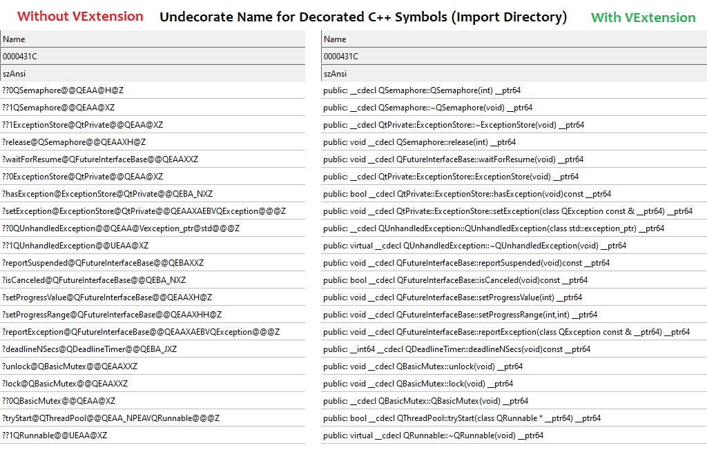
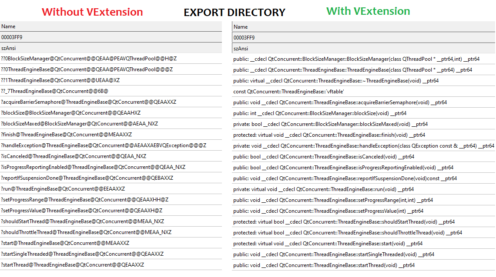

### VExtension for [NTCore Explorer Suite aka CFF Explorer](https://ntcore.com/?page_id=388)
_ _ _

#### Features

>Automatic undecorates the decorated C++ symbol names for `Import/Export Directory` tab.
>
>Shorten symbol name for several libraries such as std, boost, etc.

#### Usage

>Step 1. Install the required package [Redistributable 2019](https://aka.ms/vs/17/release/vc_redist.x64.exe) `(ignore if installed)`
>
>Step 2. Copy the folder [bins\\VExtension\\](bins/VExtension/) into the folder `C:\Program Files\NTCore\Explorer Suite\Extensions\CFF Explorer\`
>
>Step 3. Enjoy

#### Screenshots

>
>
>

##### Development

>Step 1. Required Visual Studio C++ 2019 or later.
>
>Step 2. Install [Vutils](https://github.com/vic4key/Vutils.git) library
>
>Step 3. Check [this](https://github.com/vic4key/CFF_VExtension.git) repository and start to work.

#### TODO

>- [ ] Release `32-bit` version for this extension
>
>- [ ] Detect symbol name for `Ordinal` if they are possible
>
>- [x] Shorten symbol name for several libraries such as std, boost, etc eg. `std::basic_ostream<char,struct std::char_traits<char>>` to `std::ostream`, etc (Doing)
_ _ _

Website: https://vic.onl/
